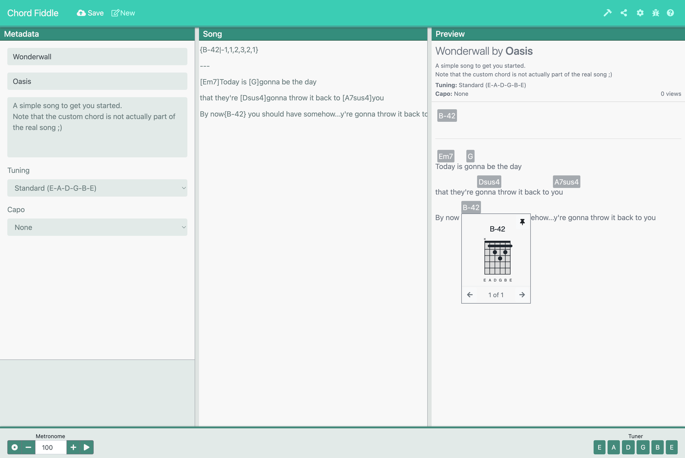

# Chord Fiddle

A web app that functions much like jsfiddle but for lyrical guitar composition instead.

> 🚀 Live at [chord-fiddle.web.app](https://chord-fiddle.web.app/)

## Features

- Create and edit lyrics using a markdown-like syntax
- Annotate lyrics with chords
- Save and share your compositions
- View and pin chord diagrams
- Metronome
- Standard Tuner

## Development

The web app was built using plain javascript, html, and css, bundled with Parcel.

The backend was designed to be serverless, and is currently up and running on [Firebase](https://firebase.google.com/). Check out the [functions](/functions) directory for more details.

## Feedback

Please read the issue [contribution guidelines](/docs/Contributing.md):

- Request a new feature on GitHub.
- Vote for Feature Requests.
- File a bug in GitHub Issues.
- Tweet about this project!